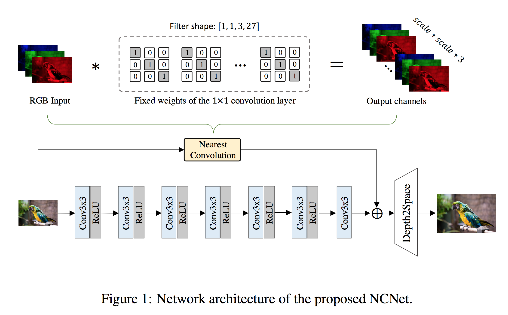

## Fast Nearest Convolution for Real-Time Image Super-Resolution, AIM & ECCV Workshops 2022, [[Paper]](https://arxiv.org/abs/2208.11609)



### Update
[**2022.08.25**] We have uploaded the pretrained model in Releases as [V1.0](https://github.com/Algolzw/NCNet/releases/tag/V1.0)

### Dependencies
- OS: Ubuntu 18.04
- Python: Python 3.7
- Tensorflow 2.9.1
- nvidia :
   - cuda: 11.2
   - cudnn: 8.1.0
- Other reference requirements

### Performance of our Nearest Convolution

|  Upsample methods   | CPU  | GPU | NPU | PSNR |
|  ----  | ----  | ----  | ----  | ----  |
| nearest  | 23.1ms | **19.0ms** | 55.0ms | 26.67 |
| bilinear  | 77.7ms | 21.0ms | 128.2ms | **27.67** |
| Conv3+depth2space  | 30.8ms | 26.5ms | 43.8ms | - |
| NearestConv+depth2space  | **15.9ms** | 20.3ms | **14.8ms** | 26.67 |

### Model Training
```python3
python main.py
```
Then the trained keras model will be saved in ```ckpt/basenet/model``` folder.

### Model Validation
```python3
python eval.py
```
Then the results of original keras model will be saved in ```original_output``` folder and you can calculate the validation PSNR by run ```python calculate_PSNR.py```

### Convert to TFLite
``` bash
python generate_tflite.py
```
Then the converted tflite model will be saved in ```TFLite ``` folder.

### TFLite Model Validation
``` bash
python test_tflite.py
```
Then the results of TFLite model will be saved in ```results ``` folder.

### Other Details

* The input image range is [0, 255].
* Number of parameters: 52,279 (53K)
* Average PSNR on DIV2K validation data: 30.27 dB
* Training data: DIV2K.

## Citations
If this repo helps your research or work, please consider citing our work.
The following is a BibTeX reference.

```
@article{luo2022fast,
  title={Fast Nearest Convolution for Real-Time Efficient Image Super-Resolution},
  author={Luo, Ziwei and Li, Youwei and Yu, Lei and Wu, Qi and Wen, Zhihong and Fan, Haoqiang and Liu, Shuaicheng},
  journal={arXiv preprint arXiv:2208.11609},
  year={2022}
}
```

## Contact
email: [ziwei.ro@gmail.com]
